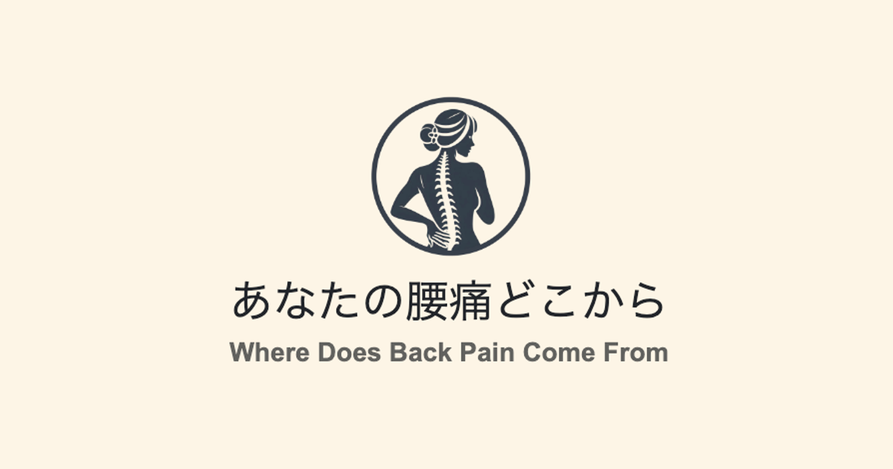

# プロジェクト名：Where Does Back Pain Come From
 

# 目次
- [サービス概要](#-サービス概要)
- [サービスURL](#-サービスurl)
- [サービス開発の背景](#-サービス開発の背景)
- [ユーザー層](#ユーザー層)
- [機能紹介](#-機能紹介)
- [技術構成について](#-技術構成について)
  - [使用技術](#使用技術)
  - [ER図](#er図)
  - [画面遷移図](#画面遷移図) 

# サービス概要
腰痛に対し、ストレッチ方法・トレーニング方法を紹介を行い、ユーザーに対して腰痛のセルフケアを伝授するサービスです。
 

# サービスURL
**https://where-does-back-pain-come-from.com**
 

# サービス開発の背景
前職・前々職にて、かん虫の強い赤ちゃんからスポーツ強豪校の学生、最終受付時間ギリギリまで仕事を頑張られている会社員、ベットでの寝たきりや車椅子でしか移動できない高齢者など、ゆりかごから墓場までの年齢層の方達と関わらせていただきました。
その際、若年層・社会人の方から
- 「お金もそこまでかけることができないため、セルフでできるケアを知りたい。」
- 「日曜しか休みがない・どこも治療院が空いておらず、せめて自分でできる運動の方法やストレッチの方法を教えてほしい。」
- 「今度老人ホームに寝たきりの母に会いに行くため、使えそうなツボの場所やストレッチの方法を教えてほしい。」
など自身のセルフケアや関係者へのケアの方法を聞かれることが多くありました。

私の自身の中でおすすめできるセルフケアアプリもなく、日々の業務で紙やPDFなどのデータにまとめる時間もなく、アプリやサイトでおすすめのストレッチ・簡単な運動方法を教えてくれるものがあればと考えており、今回の作成予定に至りました。
 

# ユーザー層
**対象ユーザー**

約10代〜50代の整体や病院へ行くほどかどうか悩んでいる腰痛症の方

**理由**

    - スマートフォン操作に慣れている
    - 指示が間違えていなければ、正しい方法でケアが行える
    - 痛みや痺れが引かなければ早期の病院受診に繋げ、病気の早期発見・正しいケアの方法を知ることができる
    　（極まれに疲れによる背中の痛みだと思っていたら、実は命に関わる病気だったなどもある)

# 機能紹介
1. 基本的なチェック項目を入力
    - 年齢、性別、病歴などの情報を入力
    - 腰痛に対しての質問をチェック形式で答えていく
2. その結果をもとに、痛みの原因と考えられる箇所に対して、ストレッチ・トレーニング方法を提示
    - 各セルフケアは「何秒」「何回」「何セット」行うかを指示
3. ユーザー登録後は、前回とは異なる方法を提示する機能を提供

# 技術構成について

| ユーザー登録 / ログイン |
| :---: | 
| <iframe frameBorder='0' width='640' height='360' webkitallowfullscreen mozallowfullscreen allowfullscreen src="https://www.awesomescreenshot.com/embed?id=34717580&shareKey=4c690bc46c1caf96ecdefdfcf29ad91c"></iframe>|
| 
『生年月日』『性別』『メールアドレス』『パスワード』『確認用パスワード』を入力してユーザー登録を行います。ユーザー登録後は、自動的にログイン処理が行われるようになっており、そのまま直ぐにサービスを利用する事が出来ます。 また、Googleアカウントを用いてGoogleログインを行う事も可能です。
 |
 

## 使用技術

| カテゴリー | 技術 |
:----|:----
| フロントエンド | HTML, CSS, JavaScript, BootstrapCSS |
| バックエンド | Rails 7.0.8.4 (Ruby 3.1.4 )  |
| インフラ | Heroku, Google Cloud Storage |
| データベース | MySQL8.0 |
| 開発環境 | Docker |
| 認証 | devise, Googleログイン |
| API | Google People API |

# 画面遷移図
Figma:https://www.figma.com/design/SiYqMI2oVfb0wILmlhX03J/%E3%81%82%E3%81%AA%E3%81%9F%E3%81%AE%E8%85%B0%E7%97%9B%E3%81%A9%E3%81%93%E3%81%8B%E3%82%89%EF%BC%9F?node-id=0-1&t=vpkvjyVycpMbZgLD-1

# ER図

